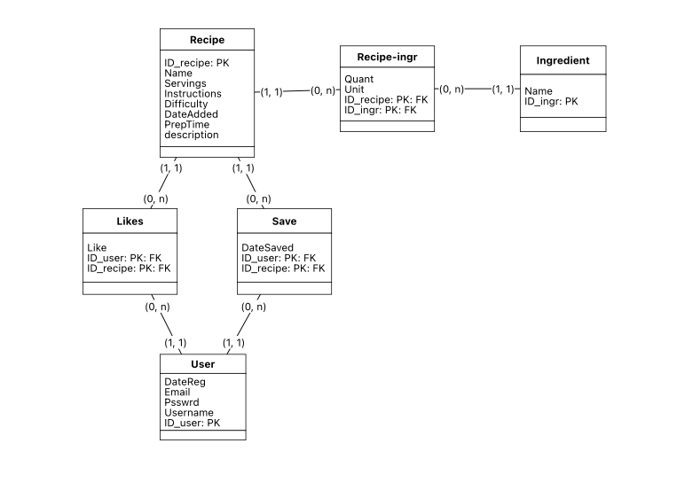

# bytebites
O projeto diz respeito a criação de um website, em formato de blog, para postagem de receitas de cozinha. 
O website é desenvolvido com o uso do framework Django, e tem como objetivo principal a prática de desenvolvimento web.

## Sobre

O website é um blog de receitas de cozinha, em que as receitas e postagens serão feitas por um administrador (eu!). Os usuários poderão vizualizar as postagens, dar like ou deslike, e salvar as receitas em sua lista de favoritos. O site também contará com um sistema de busca de receitas, onde o usuário poderá filtrar receitas por nome ou ingredientes. 

## Tecnologias
- Python
- Django
- HTML
- CSS

## Instalação
1. Clone o repositório
2. Instale o Django
3. Execute o comando `python manage.py runserver`

## Modelagem do Banco de Dados

Para permitir a busca de receitas por ingrediente, precisamos de uma tabela de relacionamento de n para n `Recipe-ingr`. Esta tabela conterá informações sobre quais ingredientes são usados em cada receita junto com suas quantidades.

Para os usuários poderem dar like/deslike em receitas e salvá-las para uso futuro, temos as tabelas `Like` e `Save`. A tabela `Like` contém informações sobre quais usuários deram like ou deslike em quais receitas ("like" é um atributo booleano). A tabela `Save` contém informações sobre quais usuários favoritaram quais receitas.

